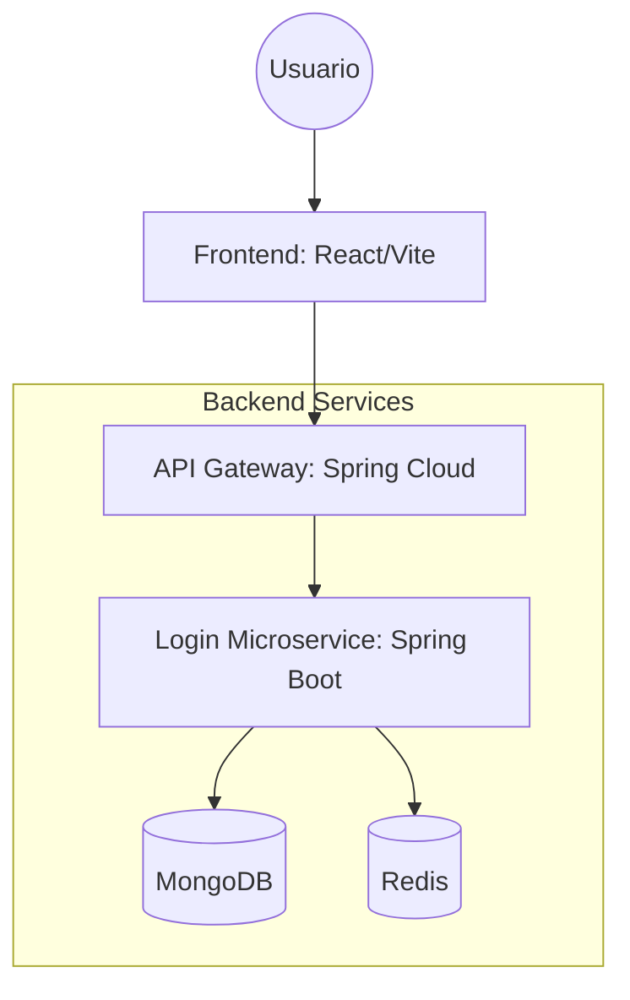

# Documentación del Proyecto: Arquitectura de Microservicios

Este documento detalla la arquitectura, los servicios, el despliegue y las pruebas del sistema basado en Spring Boot y React.

## 1. Componentes del Sistema

El sistema sigue una arquitectura de microservicios orquestada mediante Docker. Los componentes principales son:

- **Frontend (frontend-app)**: Aplicación web construida con React y Vite. Maneja la interfaz de usuario, autenticación (JWT) y visualización de datos.
- **API Gateway (api-gateway)**: Punto de entrada único basado en Spring Cloud Gateway. Se encarga del enrutamiento de peticiones a los microservicios internos y el manejo de CORS de manera centralizada.
- **Microservicio de Autenticación (login)**: Servicio Spring Boot encargado de la lógica de negocio, persistencia de usuarios y validación de sesiones.
- **Base de Datos (MongoDB)**: Almacenamiento persistente para los datos de usuarios del servicio de login.
- **Caché de Sesiones (Redis)**: Almacenamiento en memoria para validar las sesiones activas de los usuarios, permitiendo la invalidación inmediata de tokens.

### Diagrama de Componentes



## 2. Servicios Expuestos

El **API Gateway** expone el acceso a los servicios internos a través del puerto `8080`.

### Autenticación (`/auth/**`)
- `POST /auth/login`: Autentica a un usuario y devuelve un token JWT.
- `GET /auth/public-key`: Obtiene la llave pública para cifrado en el cliente.

### Gestión de Usuarios (`/users/**`)
- `GET /users`: Lista todos los usuarios registrados (Requiere rol `SUPER_ADMIN`).
- `POST /users`: Crea un nuevo usuario (Requiere rol `ADMIN` o `SUPER_ADMIN`).

### Sesiones (`/sessions/**`)
- Servicios internos para la validación de sesiones contra Redis.

## 3. Modo de Despliegue

La infraestructura está totalmente dockerizada para facilitar el despliegue.

### Prerrequisitos
- Docker y Docker Compose instalados.
- Java 17+ y Maven (para compilación local).
- Node.js y NPM (para desarrollo frontend).

### Pasos para Desplegar

1. **Compilar los servicios Java**:
   ```bash
   cd login && ./mvnw clean package -DskipTests
   cd ../api-gateway && ./mvnw clean package -DskipTests
   ```

2. **Levantar la infraestructura**:
   ```bash
   cd docker
   docker-compose up --build
   ```

3. **Acceso**:
   - Frontend: [http://localhost:3000](http://localhost:3000)
   - Gateway/API: [http://localhost:8080](http://localhost:8080)

## 4. Pruebas a Realizar

### Pruebas Unitarias e Integración (Backend)
Ejecutar los tests automatizados del microservicio de login:
```bash
cd login
./mvnw test
```
*Los tests cubren la validación de contraseñas, almacenamiento en Redis y control de acceso (Spring Security).*

### Pruebas de Frontend
Validar la legibilidad de la UI y el flujo de navegación:
1. Iniciar el servidor de desarrollo: `npm run dev` en `frontend-app`.
2. Verificar que los textos sean legibles (colores oscuros) y que no existan degradados en los títulos.
3. Probar el flujo de Login -> Lista de Usuarios con diferentes roles.

### Pruebas de Integración Manual
- **Validación de Sesión**: Iniciar sesión, borrar la entrada en Redis manualmente y verificar que las peticiones subsecuentes sean rechazadas.
- **CORS**: Verificar que el frontend puede realizar peticiones al backend a través del Gateway sin errores de política de origen.
